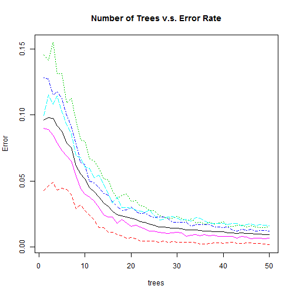

#### Introduction
This report shows how a model is built from 
[training data](https://d396qusza40orc.cloudfront.net/predmachlearn/pml-training.csv)
and used to predict the value of the **classe** variable for 
[testing data](https://d396qusza40orc.cloudfront.net/predmachlearn/pml-training.csv).

#### Loading and preprocessing the data
By inspecting the data manually, invalid data are presented in 4 different ways,
including **empty value**, **a space**, **NA**, and **#DIV/0!**. So when loading
the training and testing data, these values are translated as **NA** uniformly.

```r
trainData <- read.csv(
    "pml-training.csv", header=TRUE, na.strings = c("", " ","NA","#DIV/0!"))
testData <- read.csv(
    "pml-testing.csv", header=TRUE, na.strings = c("", " ","NA","#DIV/0!"))
str(trainData)
summary(trainData)
str(testData)
summary(testData)
```
Once the data are loaded, by checking the structure and summary of the data, two
preprocessing steps are needed:  
  1. Many columns are almost filled with **NA** values only, meaning they have no 
  contribution to the prediction, therefore they should be removed. The criteria 
  used here is that if more than half data in the column are **NA**, the column is 
  removed.  
  2. The first seven columns are metadata like row index, user name, time stamp, 
  etc., meaning they have no contribution to the prediction, therefore they 
  should be removed as well. The assumption here is that the **classe** variable 
  only depends on the health data, not on the user or on the time when activities 
  were taken.  
  
The two preprocessing steps are performed on both training and testing data set.

```r
trainData2 <- trainData[,colSums(is.na(trainData)) < (nrow(trainData) / 2)] 
trainDataCleaned <- trainData2[, -c(1:7)]
str(trainDataCleaned)
summary(trainDataCleaned)
testData2 <- testData[,colSums(is.na(testData)) < (nrow(testData) / 2)] 
testDataCleaned <- testData2[, -c(1:7)]
str(testDataCleaned)
summary(testDataCleaned)
```

#### Creating prediction model
The **caret** and **randomForest** packages are used to create the prediction 
model.  
The first step is to split the training data into two subsets for cross-validation
purpose: **cvTrainData** (60%) and **cvTestData** (40%).  
  - The **cvTrainData** data set is used to train the model.  
  - The **cvTestData** data set is used to check what the out of sample error 
  would look like.  
  
Then **random forest** method is used to create the prediction model, since it is
one of the methods that produce the highest prediction accuracy.
  - All variables except **classe** are treated as predictors, and **classe** 
  variable is treated as the outcome.  
  - **set.seed** is used with the date the report is created (20150221) to make
  the result reproducible.  
  - **ntree** parameter is set to **50** which is 10% of the default value (500) to 
  speed up the training process, while still keep reasonable accuracy. The 
  overall accuracy of the model when **ntree = 50 is 99.21%**, compared with when 
  **ntree = 500 is 99.32%**. Moreover, from the plot below, it is clear that when
  the number of trees is larger than 30, the error rate almost does not change 
  anymore.


```r
library(caret)
library(randomForest)
set.seed(20150221)
inTrain <- createDataPartition(trainDataCleaned$classe, p=0.6, list=FALSE)
cvTrainData <- trainDataCleaned[inTrain,]
cvTestData <- trainDataCleaned[-inTrain,]
modelByRF <- randomForest(classe ~ ., data=cvTrainData, ntree = 50)
plot(modelByRF,main="Number of Trees v.s. Error Rate")
```

 

Once the model is created, it is used to make predictions on the cross-validation 
test data set. Then the predictions are compared with the known **classe** values
to check the out of sample error.  
  - The overall accuracy is **99.21%**, meaning the out of sample error is quite 
  low and the model is pretty good for prediction.


```r
cvTestPrediction <- predict(modelByRF,cvTestData)
confusionMatrix(cvTestPrediction,cvTestData$classe)
```

```
## Confusion Matrix and Statistics
## 
##           Reference
## Prediction    A    B    C    D    E
##          A 2230   14    0    0    0
##          B    2 1501   17    1    0
##          C    0    3 1349   17    1
##          D    0    0    2 1268    5
##          E    0    0    0    0 1436
## 
## Overall Statistics
##                                           
##                Accuracy : 0.9921          
##                  95% CI : (0.9899, 0.9939)
##     No Information Rate : 0.2845          
##     P-Value [Acc > NIR] : < 2.2e-16       
##                                           
##                   Kappa : 0.99            
##  Mcnemar's Test P-Value : NA              
## 
## Statistics by Class:
## 
##                      Class: A Class: B Class: C Class: D Class: E
## Sensitivity            0.9991   0.9888   0.9861   0.9860   0.9958
## Specificity            0.9975   0.9968   0.9968   0.9989   1.0000
## Pos Pred Value         0.9938   0.9869   0.9847   0.9945   1.0000
## Neg Pred Value         0.9996   0.9973   0.9971   0.9973   0.9991
## Prevalence             0.2845   0.1935   0.1744   0.1639   0.1838
## Detection Rate         0.2842   0.1913   0.1719   0.1616   0.1830
## Detection Prevalence   0.2860   0.1939   0.1746   0.1625   0.1830
## Balanced Accuracy      0.9983   0.9928   0.9914   0.9925   0.9979
```

#### Predicting the classe variable for testing data
Since the model has pretty high accuracy in the cross-validation test data set, 
it is used on the real testing data to predict the value for the **classe** 
variable of the 20 test cases.

```r
testPrediction <- predict(modelByRF,testDataCleaned)
predictionResult <- as.character(testPrediction)
predictionResult
```

```
##  [1] "B" "A" "B" "A" "A" "E" "D" "B" "A" "A" "B" "C" "B" "A" "E" "E" "A"
## [18] "B" "B" "B"
```
Based on the submission results, the prediction accuracy is **100%** for the 
20 test cases.


